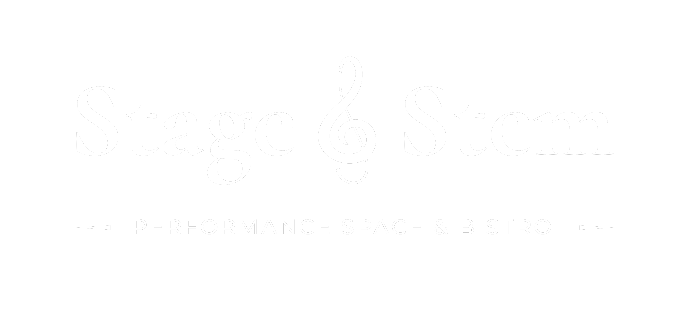

# Stage & Stem — Project Brief

## Overview

Stage & Stem is a performance space and bistro operating as one business under a single brand, split into two distinct sides. The website reflects this dual identity — two separate mini-sites that share the same brand language, with cross-linking between them.

The live domain is **stageandstem.com**, hosted on **Fasthosts** via their File Manager (public_html directory).

---

## Brand Identity

**Business name:** Stage & Stem  
**Tagline:** Performance Space & Bistro  
**Email:** info@stageandstem.com  
**Instagram:** @stageandstem

### Logo files
- `logo.jpeg` — full logo (white on black, square JPEG)
- `logo_left.png` — left half of logo (theatre mask side)
- `logo_right.png` — right half of logo (wine glass side)

### Typography
- **Serif:** Cormorant Garamond (Google Fonts) — headings, italic display text
- **Sans:** Montserrat (Google Fonts) — body, navigation, labels

### Colour palette
| Token | Value | Usage |
|---|---|---|
| Gold | `#c9a96e` | Accents, links, highlights |
| Gold dim | `rgba(201,169,110,0.25)` | Borders, dividers |
| White | `#f5f2ed` | Body text |
| Muted | `rgba(245,242,237,0.5)` | Secondary text |
| Stage BG | `#08080f` | Cool indigo-black |
| Bistro BG | `#0d0905` | Warm amber-black |

---

## File Structure

```
/
├── index.html          ← Entry/split page (root of site)
├── logo.jpeg             ← Full logo
├── logo_left.png         ← Left half (theatre/stage side)
├── logo_right.png        ← Right half (bistro/wine side)
│
├── stage/
│   ├── style.css         ← Stage styles (cool, indigo-tinted)
│   ├── stage.html        ← Stage home
│   ├── whats-on.html     ← Events/programme
│   ├── perform-with-us.html ← Performer & hire enquiries
│   └── contact_stage.html      ← Stage contact
│
└── bistro/
    ├── style.css         ← Bistro styles (warm, amber-tinted)
    ├── bistro.html        ← Bistro home
    ├── menu.html         ← Food & drink menu
    ├── book-a-table.html ← Table reservations
    └── contact_bistro.html      ← Bistro contact
```

---

## The Landing Page (index.html)

The entry point to the site. A full-screen split layout — left side links to the Stage, right side links to the Bistro.

**Key features:**
- Two equal panels side by side, each a clickable `<a>` element
- `logo_left.png` and `logo_right.png` sit side by side as a single composed logo centred at the divide
- On hover over either panel, the opposite half of the logo fades to ~12% opacity, highlighting the relevant side
- A subtle gold vertical divider line runs behind the logo
- On hover, a gold italic label fades in — "Performance Space" on the left, "Bistro" on the right
- Hover also tints the panel background (indigo tint for stage, amber tint for bistro)
- Logo reveal animation on page load (fade in + scale up)

**Links:**
- Left panel → `stage.html`
- Right panel → `bistro.html`

**The half-fade is achieved via JavaScript:** mouseenter/mouseleave events on each panel add/remove `hover-stage` or `hover-bistro` classes on `<body>`, which CSS uses to target `.logo-left` and `.logo-right` opacity.

---

## The Stage Site (stage/)

### Feel & aesthetic
Cool, theatrical, dark. Background has a subtle deep indigo/purple tint (`#08080f`). Hover states use a soft purple glow. The Stage pages use `logo_left.png` (the mask half) in the nav.

### Style variables (stage/style.css)
```css
--bg: #08080f
--bg-2: #0d0d1a
--accent: #c9a96e
--tint: rgba(80,50,140,0.12)   /* purple glow */
```

### Pages
| File | Purpose |
|---|---|
| `stage.html` | Stage home — hero + upcoming events cards |
| `whats-on.html` | Programme/events listing |
| `perform-with-us.html` | Info for performers + hire enquiries |
| `contact_stage.html` | Contact for performance/hire |

### Navigation (all stage pages)
Home · What's On · Perform With Us · Contact

### Cross-link to Bistro
Every stage page has a **corner tab** fixed to the top-right. It reads "Bistro" with a bar chart icon and links to `../bistro.html`. Style: small gold uppercase text, gold border, dark blurred background. Fades slightly on hover.

### Cross-links within content
- Cabaret Evenings card on `whats-on.html` links to `book-a-table.html`
- `contact.html` footer note links to `book-a-table.html`
- Footer on all pages links to `bistro.html`

---

## The Bistro Site (bistro/)

### Feel & aesthetic
Warm, candlelit, intimate. Background has a subtle amber/burgundy tint (`#0d0905`). Hover states use a soft warm amber glow. The Bistro pages use `logo_right.png` (the wine glass half) in the nav.

### Style variables (bistro/style.css)
```css
--bg: #0d0905
--bg-2: #130c06
--accent: #c9a96e
--tint: rgba(140,60,20,0.1)    /* amber glow */
```

### Pages
| File | Purpose |
|---|---|
| `bistro.html` | Bistro home — hero + dining info cards |
| `menu.html` | Food menu (starters, mains, desserts with prices) |
| `book-a-table.html` | Reservation page (email-based for now) |
| `contact_bistro.html` | Contact for dining/private hire |

### Navigation (all bistro pages)
Home · Menu · Book a Table · Contact

### Cross-link to Stage
Every bistro page has a **corner tab** fixed to the top-right. It reads "Stage" with a bar chart icon and links to `stage.html`.

### Cross-links within content
- Dine & Show card on `stage.html` links to `whats-on.html`
- `book-a-table.html` footer note links to `whats-on.html`
- `contact_stage.html` footer note links to `contact_stage.html`
- Footer on all pages links to `stage.html`

---

## Shared Components & Patterns

These patterns appear consistently across both sites. When adding new pages, follow these templates exactly.

### Corner Tab
```html
<a class="corner-tab" href="[other-site].html">
  <svg ...>...</svg>
  [Stage or Bistro]
</a>
```
Fixed top-right, z-index 100, gold text, gold border, blurred dark background.

### Navigation
```html
<nav>
  <a class="nav-logo" href="index.html">
     
  </a>
  <ul class="nav-links">
    <li><a href="..." class="active">Active Page</a></li>
    ...
  </ul>
</nav>
```
Add `class="active"` to the current page link.

### Section layout
```html
<div class="section">
  <p class="section-eyebrow">Short Label</p>
  <h2 class="section-title">Italic Serif Heading</h2>
  <div class="rule"><div class="rule-gem"></div></div>
  <!-- content -->
</div>
```

### Cards grid
```html
<div class="cards">
  <div class="card">
    <p class="card-date">Date or category</p>
    <h3 class="card-title">Card Title</h3>
    <p class="card-body">Description text</p>
  </div>
</div>
```

### Buttons
```html
<a class="btn btn-primary" href="...">Primary Action</a>
<a class="btn btn-outline" href="...">Secondary Action</a>
```

### Footer
```html
<footer>
  <p class="footer-copy">Stage &amp; Stem &nbsp;·&nbsp; Performance Space &amp; Bistro</p>
  <ul class="footer-links">
    <li><a href="...">Link</a></li>
    <!-- Always include a cross-link to the other site as the last item -->
    <li><a href="bistro.html">Bistro →</a></li>
  </ul>
</footer>
```

### Gold rule divider
```html
<div class="rule"><div class="rule-gem"></div></div>
```

---

## Relative Paths — Important

Because the sites live in subdirectories, paths must go up one level with `../` to reach shared assets:

| From | To logo | To other site |
|---|---|---|
| `landing.html` | `logo_left.png` | `stage.html` |
| `stage/*.html` | `../logo_left.png` | `bistro.html` |
| `bistro/*.html` | `../logo_right.png` | `stage.html` |

Each site's `style.css` lives inside its own folder and is referenced as `style.css` (no `../` needed).

---

## What's Been Built

- [x] Landing / split entry page with logo half-fade on hover
- [x] Stage site — 4 pages + CSS
- [x] Bistro site — 4 pages + CSS
- [x] Corner tab cross-linking on all pages
- [x] Contextual cross-links (e.g. Dine & Show → What's On)
- [x] Placeholder menu with example dishes and prices

## What Still Needs Building / Improving

- [ ] Google Sheets integration for events (so the client can update What's On without touching code)
- [ ] Proper events/ticketing on `stage/whats-on.html`
- [ ] Contact forms (currently email links only)
- [ ] Mobile navigation (hamburger menu for small screens)
- [ ] SEO meta tags, Open Graph tags, JSON-LD structured data
- [ ] Instagram feed or social links
- [ ] Real content from the client (copy, images, actual menu)
- [ ] About page for each side, or a shared About page
- [ ] Possible coming-soon page at the root while the full site is finished

---

## Hosting & Deployment

**Host:** Fasthosts  
**Method:** File Manager → upload to `public_html`  
**Domain:** stageandstem.com

Upload the entire folder structure as-is. All relative paths are set up correctly — as long as the folder structure is maintained, everything will resolve.

The previous coming-soon page (`index.html` at the root with `logo.png`) was already live and approved by the client. The new `landing.html` would replace or sit alongside it.

---

## Client Notes

- Client is non-technical — any content update system should be simple (e.g. Google Sheets for events)
- The client has existing Fasthosts hosting and domain
- The logo exists as JPEG (with black background) and as two split PNGs (`logo_left.png`, `logo_right.png`)
- For best results, a transparent-background PNG of the full logo would be ideal
