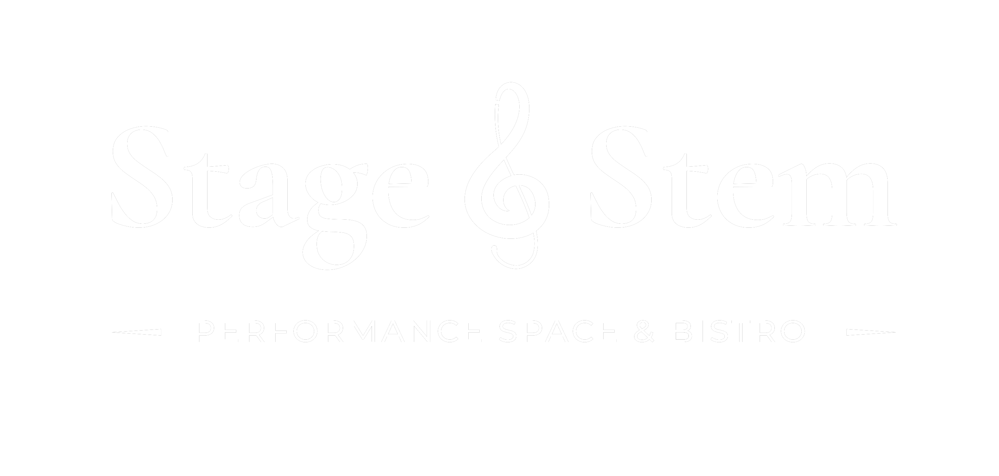

# Stage & Stem — Project Brief

## Overview

Stage & Stem is a performance space and bistro operating as one business under a single brand, split into two distinct sides. The website reflects this dual identity — two sets of pages that share the same brand language, with cross-linking between them.

It is a **flat static site**: plain HTML, CSS and a little JavaScript, with no build step and no backend. The live domain is **stageandstem.com**, hosted on **Fasthosts** via their File Manager (`public_html` directory).

> **Note on structure:** all files live in the **root** of the repository — there are no `stage/` or `bistro/` subfolders. Pages are distinguished by filename and by which stylesheet they load.

---

## Brand Identity

**Business name:** Stage & Stem  
**Tagline:** Performance Space & Bistro  
**Email:** info@stageandstem.com  
**Instagram:** @stageandstem — https://www.instagram.com/stageandstem/  
**Facebook:** https://www.facebook.com/profile.php?id=61575745712179  
**TikTok:** @stageandstemcardiff — https://www.tiktok.com/@stageandstemcardiff

### Logo files
- `logo.png` — full logo, used in the nav bar on every content page
- `logo_left.png` — left half of logo (theatre mask side), used only on the landing page
- `logo_right.png` — right half of logo (wine glass side), used only on the landing page

### Typography
- **Serif:** Cormorant Garamond (Google Fonts) — headings, italic display text
- **Sans:** Montserrat (Google Fonts) — body, navigation, labels

Fonts are loaded from Google Fonts via a `<link>` in each page's `<head>`.

### Colour palette
| Token | Value | Usage |
|---|---|---|
| Gold | `#c9a96e` | Accents, links, highlights |
| Gold dim | `rgba(201,169,110,0.25)` | Borders, dividers |
| White | `#f5f2ed` | Body text |
| Muted | `rgba(245,242,237,0.5)` | Secondary text |
| Stage BG | `#08080f` | Cool indigo-black |
| Bistro BG | `#0d0905` | Warm amber-black |

---

## File Structure

All files are in the repository root:

```
/
├── index.html              ← Split landing / entry page (self-contained)
├── about.html              ← Shared About / Our Vision page (stage-styled, linked from both sides)
│
├── stage.html              ← Stage home
├── whats-on.html           ← Stage: events/programme with filter tabs
├── perform-with-us.html    ← Stage: performer & hire enquiries
├── contact_stage.html      ← Stage contact
├── book_stage.html         ← Stage: Eventbrite ticket booking page
│
├── bistro.html             ← Bistro home
├── menus.html              ← Bistro: food & drink menu
├── book-a-table.html       ← Bistro: table reservations
├── contact_bistro.html     ← Bistro contact
├── booking-confirmed.html  ← Post-booking thank-you page (noindex)
│
├── 404.html                ← Custom 404 page (noindex)
│
├── style-stage.css         ← Stage styles (cool, indigo-tinted)
├── style-bistro.css        ← Bistro styles (warm, amber-tinted)
│
├── newsletter.js           ← Mailchimp newsletter signup handler
├── events.js               ← Builds the What's On listing from a Google Sheet
│
├── test/                   ← No-dependency Node tests + preview harness for events.js (not deployed)
│
├── logo.png                ← Full logo (nav)
├── logo_left.png           ← Left half (landing page)
├── logo_right.png          ← Right half (landing page)
│
├── og-image.png            ← Social-share image (1200×600), referenced by every page's og:image
├── favicon.ico             ← Browser tab icon (16/32/48 multi-size)
├── favicon-32.png          ← Modern-browser PNG favicon
├── apple-touch-icon.png    ← iOS home-screen icon (180×180)
├── favicon-source.png      ← 1024×1024 source — regenerate the favicon set from this
│
├── .htaccess               ← Apache rewrites (404, www → non-www, HTTPS-ready)
├── robots.txt              ← Crawler directives + sitemap pointer
└── sitemap.xml             ← Page list for search engines
```

Stage pages load `style-stage.css`; bistro pages load `style-bistro.css`. The landing page has its own inline styles and loads neither.

---

## The Landing Page (`index.html`)

The entry point to the site, and entirely self-contained — all of its CSS and JavaScript are inline; it does not use `style-stage.css`, `style-bistro.css`, or `newsletter.js`.

A full-screen split layout — the left panel links to the Stage, the right panel links to the Bistro.

**Key features:**
- Two equal panels side by side, each a clickable `<a>` element
- `logo_left.png` and `logo_right.png` sit side by side as a single composed logo centred at the divide
- On hover over either panel, the opposite half of the logo fades to ~12% opacity, highlighting the relevant side
- A subtle gold vertical divider line runs behind the logo
- On hover, a gold italic label fades in — "Performance Space" on the left, "Bistro" on the right
- On touch devices (no hover), both labels are always visible at the bottom of their respective panels, so users know which side to tap
- Hover also tints the panel background (cooler tint for stage, warmer for bistro)
- Logo reveal animation on page load (fade in + scale up)

**Links:**
- Left panel → `stage.html`
- Right panel → `bistro.html`

**The half-fade** is achieved via inline JavaScript: `mouseenter`/`mouseleave` events on each panel add/remove `hover-stage` or `hover-bistro` classes on `<body>`, which the inline CSS uses to target `.logo-left` / `.logo-right` opacity.

---

## The Stage Pages

### Feel & aesthetic
Cool, theatrical, dark. Background has a subtle deep indigo/purple tint. Hover states use a soft purple glow.

### Styles (`style-stage.css`)
```css
--bg: #08080f
--bg-2: #0d0d1a
--accent: #c9a96e
--accent-dim: rgba(201,169,110,0.25)
--white: #f5f2ed
--muted: rgba(245,242,237,0.5)
--tint: rgba(80,50,140,0.12)   /* purple glow */
--font-serif: 'Cormorant Garamond', serif
--font-sans: 'Montserrat', sans-serif
```

Includes event calendar classes: `.filter-tabs`, `.filter-tab`, `.events-list`, `.event-row`, `.event-row-date`, `.event-row-day`, `.event-row-month`, `.event-row-tag`, `.event-row-name`, `.event-row-detail`, `.event-row-action`, `.event-row-price`, `.sold-out`, `.sold-out-badge`, `.event-row--static`, `.event-status-badge` (Cancelled/Postponed), `.events-message` (loading/empty/error line), `.hire-banner`, `.btn--gold`.

Also carries the shared vision classes: `.vision-strip`, `.vision-copy`, `.vision-signoff`, `.vision-link` — identical in both stylesheets (see The About Page below).

### Pages
| File | Purpose |
|---|---|
| `stage.html` | Stage home — hero + upcoming events cards |
| `whats-on.html` | Programme/events listing — built from a Google Sheet by `events.js` |
| `perform-with-us.html` | Info for performers + hire enquiries |
| `contact_stage.html` | Contact for performance/hire |
| `book_stage.html` | Ticket booking via Eventbrite embed |

### Navigation (all stage pages)
Home · About · What's On · Perform With Us · Contact · **Bistro** (gold crosslink) — with the full `logo.png` as the nav logo. The Bistro crosslink is styled as `.nav-crosslink-item` / `.nav-crosslink` and separated from the main links by a thin gold vertical border.

### Cross-links within content
- `stage.html` cabaret card → `book-a-table.html`; CTAs → `whats-on.html`
- `whats-on.html` event rows & Book Now buttons → each event's `Ticket URL` from the sheet (usually a DesignMyNight ticket page); external links open in a new tab
- `whats-on.html` private hire banner → `contact_stage.html`
- `perform-with-us.html` CTA → `contact_stage.html`
- `contact_stage.html` inline note → `book-a-table.html`
- Footer on every stage page links to `bistro.html`

---

## The Bistro Pages

### Feel & aesthetic
Warm, candlelit, intimate. Background has a subtle amber/burgundy tint. Hover states use a soft warm amber glow.

### Styles (`style-bistro.css`)
```css
--bg: #0d0905
--bg-2: #130c06
--accent: #c9a96e
--accent-dim: rgba(201,169,110,0.25)
--white: #f5f2ed
--muted: rgba(245,242,237,0.5)
--tint: rgba(140,60,20,0.1)    /* amber glow */
--font-serif: 'Cormorant Garamond', serif
--font-sans: 'Montserrat', sans-serif
```

Adds menu and newsletter components: `.menu-section`, `.menu-item`, `.menu-item-name`, `.menu-item-price`, `.newsletter-strip`, `.newsletter-form`, `.newsletter-error`.

Also carries the shared vision classes: `.vision-strip`, `.vision-copy`, `.vision-signoff`, `.vision-link` — identical in both stylesheets (see The About Page below).

### Pages
| File | Purpose |
|---|---|
| `bistro.html` | Bistro home — hero + dining info cards |
| `menus.html` | Food & drink menu |
| `book-a-table.html` | Reservation page — DesignMyNight (Collins) booking widget |
| `contact_bistro.html` | Contact for dining/private hire |

### Navigation (all bistro pages)
Home · About · Menu · Book a Table · Contact · **Stage** (gold crosslink) — with the full `logo.png` as the nav logo.

### Cross-links within content
- `bistro.html` dine & show card → `whats-on.html`; CTA → `menus.html`
- `book-a-table.html` inline note → `whats-on.html`
- `contact_bistro.html` inline note → `contact_stage.html`
- Footer on every bistro page links to `stage.html`

---

## The About Page (`about.html`)

A single shared page carrying the client's official vision statement verbatim. It is **not** per-side: there is one statement, so there is one page.

Because there is no neutral stylesheet, it adopts the **stage side** — it loads `style-stage.css` and uses the stage nav and footer link sets, with `class="active"` on About. The two stylesheets differ only in `--bg` (`#08080f` vs `#0d0905`), so the visual cost is imperceptible; the trade-off is that a bistro visitor who clicks About lands on a stage-nav page. Its CTA row therefore includes **Book a Table**, giving them an obvious route back into the bistro flow.

Linked from the nav *and* footer of every page on both sides, plus `404.html`'s side links.

### Vision strip
A full-bleed teaser band sits between the hero and the first content section on `stage.html` and `bistro.html`:

```html
<div class="vision-strip">
  <p class="section-eyebrow">Our Vision</p>
  <div class="rule"><div class="rule-gem"></div></div>
  <p class="vision-signoff">Come for the performance.<br />Stay for the atmosphere.</p>
  <a class="vision-link" href="about.html">Read our vision &rarr;</a>
</div>
```

`.vision-signoff` is shared with `about.html`. Do **not** rebuild this band on `.newsletter-strip` — nothing would break in testing (`newsletter.js` only walks up from a submitted form), but a later restyle of the newsletter would silently restyle two vision bands. The gold rule, the larger focal line and the text-link ending are what stop this band and the newsletter strip below it reading as twins on the same page.

### Nav density
The About link makes both navs six items. Below ~884px the stage nav no longer fits beside the logo, and because `.nav-links` children keep the default `flex-shrink: 1`, "Perform With Us" wraps to a second line rather than overflowing. A `@media (min-width: 769px) and (max-width: 960px)` block in both stylesheets tightens the gap, padding and tracking to cover that band. **The `min-width: 769px` lower bound is load-bearing** — without it the block would override the mobile nav rules. Stage is the binding side here, not bistro: "Perform With Us" is ~30% wider than "Book a Table".

---

## Newsletter Signup (`newsletter.js`)

A lightweight Mailchimp signup handler included on **every content page** (not on the landing page).

**Mailchimp list:** `stageandstem.us18.list-manage.com` — list ID `05e230634f`, tag `3021990`.

How it works:
- On `DOMContentLoaded`, it binds a `submit` handler to every `.newsletter-form`
- Serialises the form, rewrites the Mailchimp `action` from `/post?` to `/post-json?`, and fires a **JSONP** request (no CORS / no page reload)
- On success: replaces the `.newsletter-strip` contents with a "Thanks for subscribing" message
- On error: strips HTML/error-code prefixes from Mailchimp's message and shows it as `.newsletter-error` above the form

**Fields collected:** First name (`FNAME`), Last name (`LNAME`), Email (`EMAIL`).

Requirements for the markup it expects:
- A `.newsletter-strip` container wrapping a `.newsletter-form`
- The form's `action` set to the Mailchimp `.../post?u=...&id=...` endpoint
- The honeypot field (`b_...`) must be present

---

## Events Calendar (`whats-on.html`)

The What's On listing is **built from a Google Sheet** by `events.js` — staff add and
remove gigs by editing the sheet, never the code. `whats-on.html` ships an empty
`.filter-tabs` and `.events-list` container plus a `<noscript>` fallback; everything else
is rendered on page load.

### What it does automatically

- **Past events drop off by themselves.** An event stays listed until the **end of its
  day**, measured in **London time** (`Europe/London`) — not the visitor's timezone, so
  someone browsing from Spain sees the same listing as someone in Cardiff. An optional
  `Ends` time hides it earlier on the day itself.
- **The filter tabs rebuild** from the categories actually present, so a tab can never
  filter to an empty list.
- Events are sorted by date, then name.

### The sheet

One row per event. **Only `Date` and `Name` are required** — every other cell may be left
blank and the row still renders.

| Column | Example | Notes |
|---|---|---|
| **Date** | `2026-04-12` | **Required.** `YYYY-MM-DD` (also accepts `DD/MM/YYYY`). |
| **Ends** | `20:00` | Optional. Hide time on the event day. Blank = show all day. `8pm` also works. |
| **Category** | `Music` | Optional. Drives the filter tabs. Use consistent spelling. |
| **Tag** | `Jazz · Live Music` | Optional. Small label above the name. |
| **Name** | `An Evening of Jazz` | **Required.** |
| **Detail** | `Doors 6:30pm · Show 8pm` | Optional. One line of description. |
| **Price** | `£45` | Optional. A bare number (`45`) gets a `£` added automatically. |
| **Price note** | `per person` | Optional. Small text after the price. |
| **Status** | *(blank)* | Optional dropdown — see below. |
| **Ticket URL** | `https://tickets.designmynight.com/…` | Optional. The event's DesignMyNight ticket page. No URL = no "Book Now" button and the row isn't clickable. |

Keep the tab (sheet) named **`Events`** and the header row on **row 1** (data starts row 2).
To rename the tab, change `range` in `events.js`.

### Status column

Use a dropdown (Data → Data validation) with these exact values:

| Status | Renders as |
|---|---|
| *(blank)* | Normal row — price + **Book Now** |
| `Sold out` | Dimmed, `Sold Out` badge, no button |
| `Cancelled` | Name struck through, `Cancelled` badge, no button |
| `Postponed` | `Postponed` badge, no button |

> **"Sold out" is one cell in the sheet, not automatic.** Genuinely automatic sold-out
> would have to come from DesignMyNight, which has no usable public events API (see
> "Ticket Booking" below). Flipping one dropdown cell is the win here — no code edit, no
> deploy.

### Setup (one-time)

1. **Create the sheet** with the header row above. Share it: **Anyone with the link → Viewer**
   (the API needs it readable), or use *File → Share → Publish to web*.
2. **Get the sheet ID** — the long string in the URL:
   `https://docs.google.com/spreadsheets/d/`**`THIS_PART`**`/edit`
3. **Create an API key** — [Google Cloud Console](https://console.cloud.google.com/) → new
   project → *APIs & Services* → enable **Google Sheets API** → *Credentials* → *Create
   credentials → API key*. Then **restrict it** (this matters):
   - *API restrictions* → **Google Sheets API** only.
   - *Application restrictions* → **HTTP referrers** → add `https://stageandstem.com/*` and
     `https://www.stageandstem.com/*`.
4. Put both values in the `CONFIG` block at the top of **`events.js`**.

> **The API key is in `events.js`, which is public.** That's an accepted trade-off: it's
> read-only, limited to the Sheets API, tied to the `stageandstem.com` referrer, and points
> at a sheet that's already published. It **must** stay referrer-restricted — otherwise it
> can be copied from the file and spent against the quota.

### A gig in three steps

1. Add a row to the sheet: `Date`, `Name`, and whatever else you have.
2. Paste the DesignMyNight ticket link into `Ticket URL`.
3. That's it — the page picks it up on next load. Sold out later? Set `Status` to `Sold out`.

### The SEO trade-off (known, accepted)

Because events are fetched by JavaScript, they're **not in the page source**, so Google
won't index individual gigs and there are no `Event` rich results. The rest of the site
leans hard the other way (JSON-LD, canonicals, sitemap), so this cuts against the grain.
The upgrade path — if it ever matters — is a scheduled GitHub Action that rewrites
`whats-on.html` with real markup + `Event` JSON-LD and deploys it to Fasthosts. That's a
change to how the site is built, so it hasn't been done.

### Testing

`test/` holds no-dependency Node tests (`node --test test/events.test.js test/render.test.js`)
covering the date cutoff, timezone independence, blank cells, Status handling and the
empty/error states against fixture JSON. `test/preview.html` renders the listing from a
local fixture (no sheet, no network) for eyeballing layout — open it via a local static
server. None of `test/` is uploaded to Fasthosts.

---

## Table Booking (`book-a-table.html`)

The Bistro reservation page embeds the **DesignMyNight (Collins) V2 booking widget**. Venue ID
`6a590682cf09d068cf42ee25`. Requires the DMN Business Plan.

Stages 1–3 (booking type, date/guests, time) render as **real elements inside the page**, so site CSS
reaches them. Stage 4 is a DMN-hosted iframe/modal we cannot style without DMN whitelisting a
stylesheet against the venue group — currently we accept their default there.

**If you regenerate the code in Collins → Widget Wizard, re-apply these fixes before pasting it in.**
The raw Wizard output ships with four defects:

| Wizard output | Fix | Why |
|---|---|---|
| `src="//widgets…"` | **leave exactly as-is** | See the warning below — do not "fix" this |
| `locale="undefined"` | delete the attribute | A literal JavaScript `undefined` leaks into the markup |
| `return-url="https://www.stageandstem.com/"` | apex host + a real confirmation page | The Wizard emits the `www.` host, which `.htaccess` 301-redirects to apex — and a 301 **discards the POST body**, losing the return. It also pointed at `/`, the split-door landing page. See the return flow below |
| Placeholder colours (green/yellow) | brand palette | See below |

### ⚠️ Do not rewrite the script `src` to `https://`

The `src` **must** stay protocol-relative (`//widgets.designmynight.com/…`). Rewriting it to an
explicit `https://` makes DMN's loader **silently skip the tag** — the script still loads and defines
its `DMN` global, but no widget ever renders and no error is logged. Their loader evidently matches
its own tag against the literal `//widgets…` src string, so any other prefix fails `isValidTag()`.

This was confirmed by bisect (see git history for `dmn-test-bisect.html`): six variants of the
snippet, one delta each. Only the `https://` change failed — removing `locale`, removing the
`return-*` attributes and adding `custom-source` all rendered fine.

It looks like a protocol-downgrade risk on a non-SSL page, and it is — but the remedy is the
force-HTTPS redirect in `.htaccess`, which makes `//` resolve to HTTPS everywhere anyway. Fixing it
on the script tag just breaks the widget.

**Colours** live on the `onsass.designmynight.com` stylesheet `<link>` in `<head>`, not on the script:
`primary-color=%23c9a96e` (gold), `background-color=%230d0905`, `body-text-color=%23f5f2ed`.
They **must stay `%23`-encoded** — a raw `#` starts the URL fragment and the colour is silently
dropped, leaving a widget that looks almost right but in DMN's default accent. DMN's own docs show
the unencoded form; don't copy it. The `&` separators are written `&amp;` for HTML validity.

**Two CSS details in `style-bistro.css` that are load-bearing:**
- `.booking-widget { color-scheme: dark }` — makes native selects and date pickers render in dark OS
  chrome. Without it the dropdown options are near-white on near-white. DMN's FAQ lists this as a
  common failure on dark sites.
- The container border/padding is applied via `.booking-widget:has(:not(script))`, so it only draws
  once DMN has rendered something. If the script is blocked by an ad-blocker or corporate proxy the
  wrapper collapses instead of leaving a confusing empty box — `<noscript>` does not cover that case,
  since JS is enabled and only the fetch failed.

The script must stay **inside** `<div class="booking-widget">`: the V2 widget renders into its script
tag's parent element and has no container-id option.

`custom-source="Website"` tags bookings for Collins' Source Breakdown report — the Source must exist
in Collins or bookings arrive unattributed.

### Post-booking return flow

```
return-url="https://stageandstem.com/booking-confirmed.html"
return-method="post"
```

After booking, DMN sends the customer to **`booking-confirmed.html`** — a bistro-styled thank-you
page. Two rules about it:

- **Apex host, never `www.`** The Wizard regenerates this as `www.stageandstem.com`; `.htaccess`
  301-redirects that to apex, and a 301 discards the POST body, so the return breaks.
- **The page shows no booking details, deliberately.** DMN emails the customer a full summary
  anyway, and a static host cannot read a POST body — so the page ignores the payload entirely and
  says "check your inbox". This also keeps personal data out of the page and out of the URL, which
  is why `return-method="post"` is used rather than the GET default (DMN deprecated GET returns for
  GDPR reasons — they put name, email, phone and DOB in the query string).

`booking-confirmed.html` is `noindex, nofollow` and deliberately **absent from `sitemap.xml`** — it's
a transient state, not a destination.

**POST returns are confirmed working** end to end — the host serves `booking-confirmed.html` on a
POST rather than answering 405, which was the one real risk with this approach.

If that ever regresses (a host or config change), the symptom is customers hitting a
**405 Method Not Allowed** immediately after booking. The fallback is to delete the `return-method`
attribute, which drops DMN back to a GET return — reliable on any static host, at the cost of the
customer's name, email, phone and DOB appearing in the URL and browser history.

The booking block is centred as a single composition above 768px via `.booking-section` in
`style-bistro.css`, and the widget is centred within its frame by `.booking-widget > :not(script)`.

That selector is **deliberately name-agnostic**. Nobody here has been able to load the widget to
confirm its markup — DMN's hosts are unreachable from the dev environment — so the rule must not
depend on an id or class of theirs. An earlier `#dmn-partner-widget` rule, taken from DMN's docs on
faith, matched nothing at all and was removed. The centring uses both `margin-inline: auto` and
`text-align: center` on the parent, because a block root is centred by the former and an
`inline-block` root only by the latter, and we don't know which it is. The `text-align: left` on the
child then restores normal alignment inside the form.

---

## Ticket Booking (`book_stage.html`)

A Stage-branded page that embeds the Eventbrite booking widget.

**To wire up Eventbrite:**
1. Log in to Eventbrite → Manage Events → your event → Promote → Embed
2. Copy the widget code
3. In `book_stage.html`, find the `<!-- EVENTBRITE EMBED -->` comment block and replace the placeholder `<div>` and `<script>` tags with your copied embed code

The page currently uses `widgetType: 'checkout'` for a single event. If you want to show all events in one widget, Eventbrite also supports `widgetType: 'collection'` with a `collectionId`.

---

## Shared Components & Patterns

These patterns appear consistently across the stage and bistro pages. When adding new pages, follow these templates.

### Navigation
```html
<nav>
  <a class="nav-logo" href="index.html">
    
  </a>
  <input type="checkbox" id="nav-toggle" class="nav-toggle" />
  <label class="nav-burger" for="nav-toggle" aria-label="Toggle menu">
    <span></span><span></span><span></span>
  </label>
  <ul class="nav-links">
    <li><a href="..." class="active">Active Page</a></li>
    ...
    <!-- Always last — crosslink to the other side -->
    <li class="nav-crosslink-item">
      <a href="bistro.html" class="nav-crosslink">Bistro</a>
    </li>
  </ul>
</nav>
```
Add `class="active"` to the current page link. The crosslink is always the final `<li>`, separated by a thin gold left border via `.nav-crosslink-item`.

### Section layout
```html
<div class="section">
  <p class="section-eyebrow">Short Label</p>
  <h2 class="section-title">Italic Serif Heading</h2>
  <div class="rule"><div class="rule-gem"></div></div>
  <!-- content -->
</div>
```

### Cards grid
```html
<div class="cards">
  <div class="card">
    <p class="card-date">Date or category</p>
    <h3 class="card-title">Card Title</h3>
    <p class="card-body">Description text</p>
  </div>
</div>
```

### Buttons
```html
<a class="btn btn-primary" href="...">Primary Action</a>
<a class="btn btn-outline" href="...">Secondary Action</a>
<a class="btn btn--gold" href="...">Gold Action (events)</a>
```

### Newsletter strip
```html
<div class="newsletter-strip">
  <p class="newsletter-eyebrow">Stay in the loop</p>
  <h2 class="newsletter-title">Updates, direct to your inbox</h2>
  <p class="newsletter-sub">Your copy here.</p>
  <form action="https://stageandstem.us18.list-manage.com/subscribe/post?u=f675c39799c38096ac60029aa&id=05e230634f&f_id=00d9a9e6f0"
        method="post" name="mc-embedded-subscribe-form" class="newsletter-form" target="_self" novalidate>
    <input type="text" name="FNAME" placeholder="First name">
    <input type="text" name="LNAME" placeholder="Last name">
    <input type="email" name="EMAIL" placeholder="Your email address" required>
    <input type="hidden" name="tags" value="3021990">
    <div aria-hidden="true" style="position:absolute;left:-5000px">
      <input type="text" name="b_f675c39799c38096ac60029aa_05e230634f" tabindex="-1" value="">
    </div>
    <button type="submit">Subscribe</button>
  </form>
</div>
```
Include `<script src="newsletter.js"></script>` before `</body>` on every page that uses this.

### Footer
```html
<footer>
  <p class="footer-copy">Stage &amp; Stem &nbsp;·&nbsp; Performance Space &amp; Bistro</p>
  <ul class="footer-links">
    <li><a href="...">Link</a></li>
    <!-- Always include a cross-link to the other side as the last item -->
    <li><a href="bistro.html">Bistro →</a></li>
  </ul>
  <ul class="social-links">
    <li><a href="https://www.instagram.com/stageandstem/" aria-label="Instagram" target="_blank" rel="noopener"><!-- svg --></a></li>
    <li><a href="https://www.facebook.com/profile.php?id=61575745712179" aria-label="Facebook" target="_blank" rel="noopener"><!-- svg --></a></li>
    <li><a href="https://www.tiktok.com/@stageandstemcardiff" aria-label="TikTok" target="_blank" rel="noopener"><!-- svg --></a></li>
  </ul>
</footer>
```
Social links use inline SVG icons. All three accounts are live and open in a new tab. The brand runs Instagram, Facebook and TikTok only — the X (Twitter) icon was removed. The block is copy-pasted, so a handle change means editing every page (plus the `sameAs` array in each page's JSON-LD).

### Gold rule divider
```html
<div class="rule"><div class="rule-gem"></div></div>
```

### Contact page layout

Both contact pages use a shared two-column layout. On desktop the left column holds contact info and the right column holds a Google Maps embed; on mobile both stack to a single column.

```html
<div class="section" style="padding-top:5rem;">
  <p class="section-eyebrow">Get in Touch</p>
  <h1 class="section-title">Contact the Stage</h1>
  <div class="rule"><div class="rule-gem"></div></div>

  <div class="contact-grid">
    <div class="contact-info">
      <!-- email button, address, social links, crosslink note -->
    </div>
    <div class="contact-map">
      <iframe src="https://maps.google.com/maps?q=199+Richmond+Road+Cardiff+CF24+3BT&output=embed"
              allowfullscreen loading="lazy" referrerpolicy="no-referrer-when-downgrade"
              title="..."></iframe>
    </div>
  </div>

  <div class="contact-faqs">
    <h2 class="contact-faqs-title">Common Questions</h2>
    <div class="faq-grid">
      <div class="faq-entry">
        <p class="faq-entry-q">Question label</p>
        <p class="faq-entry-a">Answer text.</p>
      </div>
      <!-- repeat for each Q&A pair -->
    </div>
  </div>
</div>
```

Key CSS classes:
| Class | Purpose |
|---|---|
| `.contact-grid` | Two-column grid (1fr 1fr) with `gap: 4rem`; collapses to 1fr on mobile |
| `.contact-info` | Left column — text, email button, address details, social links |
| `.contact-map` | Right column — contains the map iframe |
| `.contact-map iframe` | Full-width, 420px tall, gold border |
| `.contact-detail` | Labelled detail block (address, hours, etc.) |
| `.contact-detail-label` | Small uppercase accent-coloured label |
| `.contact-detail-value` | Muted body text below the label |
| `.contact-faqs` | FAQ section below the grid; top gold border, `margin-top: 5rem` |
| `.contact-faqs-title` | Italic serif heading for the FAQ section |
| `.faq-grid` | Two-column grid of Q&A entries; collapses to 1 column on mobile |
| `.faq-entry-q` | Tiny uppercase gold question label |
| `.faq-entry-a` | Muted answer text |

The FAQ entries are static (no accordion, no JavaScript). All questions and answers are always visible.

---

## SEO & Discoverability

Every content page carries the same SEO scaffolding directly in its `<head>` — there is no template engine, so additions are duplicated across pages.

### Per-page head additions
Each page adds the following after `<title>`:
- `<meta name="description">` — unique 140–160 character summary
- `<link rel="canonical" href="https://stageandstem.com/...">`
- Open Graph: `og:type`, `og:site_name`, `og:locale` (`en_GB`), `og:title`, `og:description`, `og:url`, `og:image`, `og:image:width` / `og:image:height`
- Twitter Cards: `twitter:card` (`summary_large_image`), `twitter:title`, `twitter:description`, `twitter:image`
- Favicons: `<link rel="icon" href="/favicon.ico">`, `<link rel="icon" type="image/png" sizes="32x32" href="/favicon-32.png">`, `<link rel="apple-touch-icon" sizes="180x180" href="/apple-touch-icon.png">`
- `<meta name="theme-color">` — `#08080f` on stage / landing / 404, `#0d0905` on bistro pages

`og-image.png` (1200×600) is the shared social-share image referenced by every page's `og:image` / `twitter:image`.

The landing page also includes a `.visually-hidden` `<h1>` ("Stage & Stem — Performance Space & Bistro in Cardiff") so the split layout still exposes a heading to crawlers and screen readers.

`404.html` is set to `noindex, follow` and intentionally omits canonical / OG / JSON-LD.

### Structured data (JSON-LD)
Each page's `<head>` includes one or more `<script type="application/ld+json">` blocks:
- **`Organization`** — on every content page. Carries name, URL, logo, image, `sameAs` (Instagram, Facebook, TikTok), Richmond Road `PostalAddress`, and a `contactPoint` with `info@stageandstem.com`. Its `description` is paragraph 1 of the client's vision statement, duplicated across 11 pages — note it contains the word "new", which will date.
- **`Restaurant`** — on the four bistro pages (`bistro`, `menus`, `book-a-table`, `contact_bistro`). Includes `priceRange: "£"`, `currenciesAccepted: "GBP"`, `hasMenu: ".../menus.html"`, `acceptsReservations: true`.
- **`PerformingArtsTheater`** — on the five stage pages (`stage`, `whats-on`, `perform-with-us`, `contact_stage`, `book_stage`).
- **`AboutPage`** — on `about.html` only. Points `mainEntity` at the `#organization` node. `PerformingArtsTheater` / `Restaurant` are deliberately omitted there — both are already defined on nine other pages with their own canonical `url`, so a copy would add nothing and muddy which URL owns the entity.
- **`FAQPage`** — on both contact pages (`contact_bistro`, `contact_stage`), mirroring the visible FAQ section on each page (opening hours / bookings / parking / accessibility, etc.).

Restaurant and Theater both link back to the Organization via `parentOrganization: { "@id": "https://stageandstem.com/#organization" }`.

**Currently omitted from the schema** (add as a follow-up when known): `telephone`, `openingHoursSpecification`, `servesCuisine`.

### `sitemap.xml` and `robots.txt`
`sitemap.xml` lists the 11 indexable pages (`404.html` is excluded) with `<lastmod>`, `<changefreq>` and `<priority>`. `robots.txt` allows all crawlers and points to the sitemap.

After deploying, submit `https://stageandstem.com/sitemap.xml` to Google Search Console.

### `.htaccess`
- `ErrorDocument 404 /404.html`
- 301 redirect: `www.stageandstem.com` → `stageandstem.com`
- Force-HTTPS rule is **commented out** — uncomment the two `RewriteCond %{HTTPS} off` / `RewriteRule` lines once SSL is provisioned on the domain.

### Favicon assets
Three favicon files (`favicon.ico`, `favicon-32.png`, `apple-touch-icon.png`) are derived from `favicon-source.png` (1024×1024 PNG — comedy mask + wine glass on black). To regenerate them after editing the source, run any favicon tool (e.g. realfavicongenerator.net), or use Pillow:

```python
from PIL import Image
src = Image.open("favicon-source.png").convert("RGBA")
src.resize((180, 180), Image.LANCZOS).convert("RGB").save("apple-touch-icon.png", "PNG", optimize=True)
src.resize((32, 32), Image.LANCZOS).save("favicon-32.png", "PNG", optimize=True)
src.save("favicon.ico", format="ICO", sizes=[(16, 16), (32, 32), (48, 48)])
```

---

## Paths

Because the site is flat (all files in the root), every link and asset reference is a plain filename — no `../` and no subfolder prefixes. For example, pages link to `logo.png`, `style-stage.css`, `bistro.html`, etc. directly. Keep all files in the same directory and everything resolves.

---

## What's Been Built

- [x] Landing / split entry page with logo half-fade on hover (`index.html`); panel labels permanently visible on touch devices
- [x] Stage pages — 5 pages + `style-stage.css`
- [x] Bistro pages — 4 pages + `style-bistro.css`
- [x] Nav crosslinks on all pages (Bistro link on stage pages, Stage link on bistro pages)
- [x] Contextual cross-links (e.g. Dine & Show → What's On)
- [x] Placeholder menu with example dishes and prices
- [x] Newsletter signup strip on all content pages, wired to Mailchimp (`newsletter.js`)
- [x] Events listing on `whats-on.html` driven by a Google Sheet (`events.js`) — past events drop off automatically on London time, filter tabs rebuild from categories present, Status column for Sold out / Cancelled / Postponed
- [x] Ticket booking page (`book_stage.html`) with Eventbrite embed placeholder
- [x] Social links in footer of all pages (Instagram, Facebook and TikTok all live)
- [x] Shared About page (`about.html`) carrying the client's official vision statement, teased by a vision strip on both home pages
- [x] Mobile hamburger nav on all pages
- [x] SEO foundation: per-page meta descriptions, canonical URLs, Open Graph & Twitter Cards
- [x] JSON-LD structured data (`Organization` sitewide; `Restaurant` on bistro pages; `PerformingArtsTheater` on stage pages; `FAQPage` on both contact pages)
- [x] Favicon set (ICO + 32px PNG + 180px apple-touch) generated from `favicon-source.png`
- [x] `robots.txt`, `sitemap.xml`, and `.htaccess` redirects (404, www → non-www, HTTPS-ready)
- [x] Contact page desktop layout — two-column grid (contact info + Google Maps embed) with FAQ grid below; responsive single-column on mobile

## What Still Needs Building / Improving

- [ ] Wire up Eventbrite event ID in `book_stage.html` (replace placeholder embed)
- [ ] Real content from the client (copy, images, actual menu)
- [ ] Contact forms (still email links only — bistro table booking now uses DesignMyNight)
- [ ] Phone number, opening hours and `servesCuisine` — currently omitted from JSON-LD; add when confirmed
- [ ] Uncomment the force-HTTPS rule in `.htaccess` once SSL is provisioned on the domain
- [ ] Submit `sitemap.xml` to Google Search Console after first deploy
- [ ] Fill in the `sheetId` and `apiKey` in `events.js` and populate the Google Sheet (see "Events Calendar") — the integration is built; it needs the sheet + a referrer-restricted API key
- [ ] Optional: scheduled GitHub Action to pre-render `whats-on.html` with `Event` JSON-LD, if event SEO becomes a priority (see "Events Calendar → SEO trade-off")

---

## Known Issues / Cleanup Candidates

- **`.DS_Store` is tracked in git.** This is a macOS Finder metadata file with no purpose in the repo. It should be removed and added to a `.gitignore`.

---

## Hosting & Deployment

**Host:** Fasthosts  
**Method:** File Manager → upload to `public_html`  
**Domain:** stageandstem.com

The site is flat, so upload all files into `public_html` together (no subfolders to recreate). `index.html` serves as the landing page at the domain root.

---

## Client Notes

- Client is non-technical — any content update system should be simple (e.g. Google Sheets for events)
- The client has existing Fasthosts hosting and domain
- Logo exists as `logo.png` (full) and as two split halves (`logo_left.png`, `logo_right.png`)
- For best results, a transparent-background PNG of the full logo would be ideal
